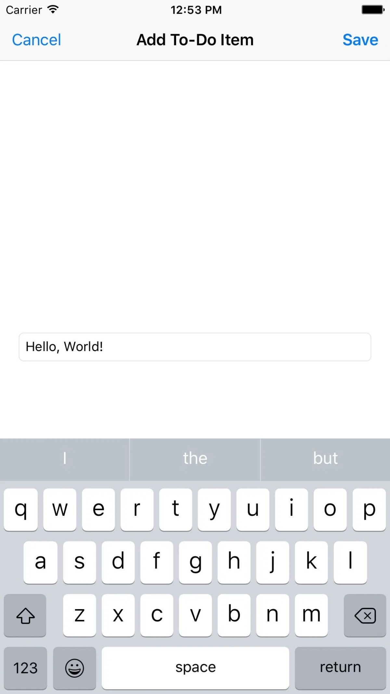
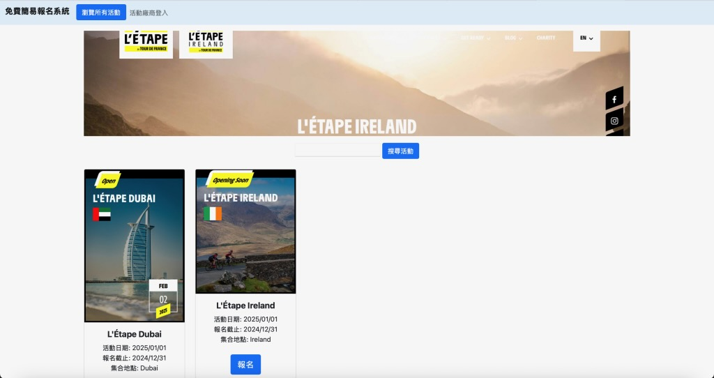
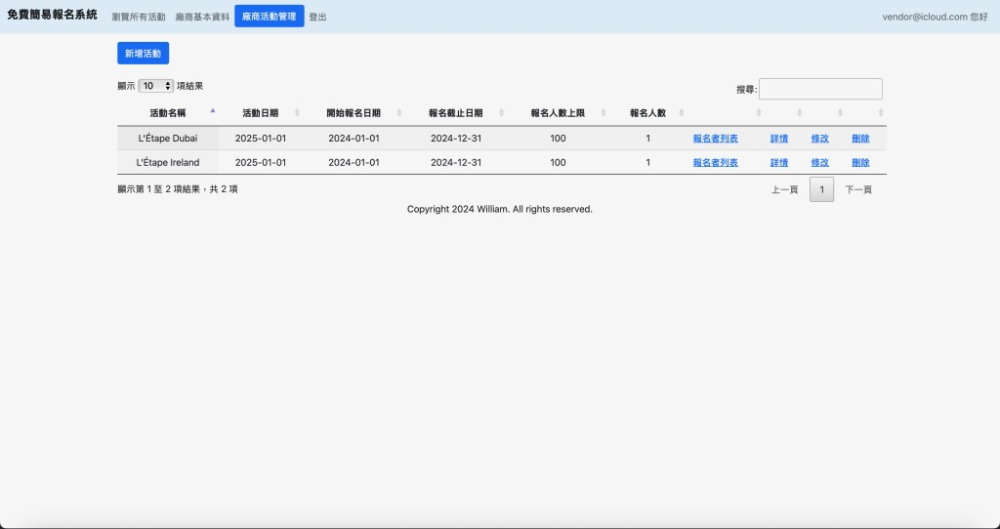

## About

My understanding of software engineering goes beyond simply developing features. I believe it starts with real business needs and involves thinking about how a system should be designed, implemented, deployed, and maintained over the long term. Therefore, I hope to gradually develop toward becoming a Solution Architect and an implementation-oriented AI Engineer, building end-to-end capabilities from requirements analysis to system delivery.

When facing a system requirement, I first ask, “What problem are we trying to solve?” and “What does success look like?” I then analyze the users, use cases, traffic, and requirements, break them down into core functions and modules, and only then move on to data architecture, system architecture, and technology selection.

I believe the core value of a Solution Architect is the ability to translate business requirements into practical and implementable technical solutions. When designing a system, I consider how components such as APIs, databases, queues, caches, and AI services should work together, while also taking into account performance, availability, scalability, reliability, maintainability, cost, and future growth.

In terms of deployment, my understanding is that Docker packages and standardizes an application along with its runtime environment, ensuring that the application can run consistently across different environments. Kubernetes takes this a step further by managing the deployment of containers at scale, including resource management, self-healing, service discovery, and horizontal scaling.

At a higher level, these technologies are also important components of Cloud-Native Architecture. Cloud-native emphasizes designing systems using approaches such as microservices, containers, Kubernetes, DevOps, CI/CD, and automation. The goal is to build applications with high scalability, resilience, and maintainability while making more effective use of the resources and capabilities provided by cloud environments.

My goal is not simply to become an engineer who can write code, but someone who understands why a system is designed in a certain way and can turn that architecture into a reliable and maintainable system. As AI applications continue to evolve, I believe AI Engineers also need strong software engineering and architectural skills. Building a practical AI system involves much more than integrating an LLM API—it also requires handling data, knowledge bases, access control, data isolation, reliability, cost, and operations.

Therefore, I hope to gain hands-on experience building systems from 0 to 1 through real-world projects. By combining the system design capabilities of a Solution Architect with the implementation skills of an AI Engineer, I aim to become an engineer who can understand business needs, design solid architectures, and actually build and operate systems in production.

我對軟體工程的理解，不只是把功能開發出來，而是從實際業務需求出發，思考系統如何設計、實作、部署與長期維運。因此，我希望逐步往 Solution Architect 與實作型 AI Engineer 的方向發展，建立從需求分析到系統落地的完整能力。

面對系統需求時，我會先確認「要解決什麼問題」以及「什麼結果才算成功」，再分析使用者、使用情境、流量與需求，拆解功能與模組，最後進行資料架構、系統架構與技術選型。

我認為 Solution Architect 的核心價值，是將業務需求轉換成可落地的技術方案。設計系統時，除了思考 API、Database、Queue、Cache、AI Service 等元件如何協作，也需要考量 Performance、Availability、Scalability、Reliability、Maintainability，以及成本與未來擴展性。

在部署方面，我理解 Docker 是將應用程式與執行環境封裝並標準化，確保應用程式能夠在不同環境中一致地執行；Kubernetes 則進一步負責大規模 Container 的部署、資源管理、自我修復、服務發現與水平擴展。

而從更高層次來看，這些技術也是 Cloud-Native Architecture 的重要組成部分。Cloud-Native 強調以微服務、Container、Kubernetes、DevOps、CI/CD 以及自動化等方式來設計系統，使應用程式能夠具備高度可擴展性、彈性與可維運性，並能更充分地利用雲端環境的資源與特性。

我希望未來不只是成為能完成程式碼的工程師，而是能理解「為什麼這樣設計」，並真正將架構落實成可運作、可維護的系統。尤其在 AI 應用快速發展的環境下，我認為 AI Engineer 也需要具備軟體工程與架構能力，除了 LLM API，更要處理資料、知識庫、權限、隔離、可靠性、成本與維運。

因此，我希望透過實際專案累積從 0 到 1 建置系統的經驗，結合 Solution Architect 的系統設計能力與 AI Engineer 的實作能力，成為一名能理解業務、設計架構，也能真正把系統做出來並持續運行的工程師。

## Skills

Software Architecture: Microservices, DDD & Clean/Hexagonal(Ports & Adapters), Event-Driven, SOA, Layered(MVC & N-Tier), Monolith, Pipe and Filter, SaaS Multi-Tenant

Programming Languages: Java, Python, JavaScript, C/C++, PHP, Swift, Objective-C, C#, Shell Script

Backend Technologies : Spring Cloud, Spring Boot, Spring MVC, Spring Security(OAuth2/JWT), Spring Batch, JPA(Hibernate), MyBatis, Node.js, RESTful API

Frontend Technologies: HTML, CSS, JSP, Struts, Tiles, JSF, Thymeleaf, jQuery, AJAX, Bootstrap, Vue.js, Angular

Database Technologies: PostgreSQL, MySQL, Oracle, DB2, SQL Server, SQLite, Redis, MongoDB, SQL, Stored Procedure

Messaging & Streaming: RabbitMQ, Kafka

DevOps & Cloud: Docker, K8s, Maven, Gradle, Git, Jenkins, GitLab CI/CD, Prometheus, Grafana, AWS EC2/S3, GCP/GKE

Testing: JUnit, Mockito, Selenium/Playwright

Design Patterns: Factory, Singleton, Adapter, Decorator, Facade, Proxy, Template Method

## Projects

## [Plain To-Do List](https://github.com/williamliu197/ToDoList)

An iOS project developed in Objective-C that was previously published on the App Store.

## [Event Holder](https://github.com/williamliu197/event-holder)

A web project built with OpenJDK 17, Spring Boot 3, Maven 3, MyBatis 3, Thymeleaf 3, jQuery 3.6, Bootstrap 5, DataTables, and RabbitMQ 3.

### AI Resume Assistant

Developed a side project centered around a RAG knowledge base and AI Agent, taking primary responsibility for data processing, knowledge base development, and AI workflow integration.

* Cleaned and processed raw data, and designed the Chunking, Metadata, and Embedding pipelines.

* Built a RAG system integrating a Vector Database and LLM for information retrieval and question answering.

* Designed AI Agent / Workflow pipelines, integrating APIs and different AI components to automate end-to-end processes.

* When encountering inaccurate responses, systematically debugged the pipeline layer by layer, including data quality, chunking, retrieval, prompting, and model output, rather than simply modifying prompts.

Delivered a practical AI knowledge Q&A and automation workflow, enabling users to retrieve information and obtain analytical results through natural language.

自行實作一個以 RAG 知識庫與 AI Agent 為核心的 side project，主要負責資料處理、知識庫建置及 AI Workflow 串接。

* 整理與清洗原始資料，設計 Chunk、Metadata 與 Embedding 流程。

* 建置 RAG，串接 Vector DB 與 LLM，處理資料檢索與回答。

* 設計 Agent / Workflow，串接 API 與不同 AI 節點完成自動化流程。

* 遇到回答不準時，會從資料品質、Chunk、Retrieval、Prompt 到模型輸出逐層排查，而不是單純修改 Prompt。

最後完成可實際使用的 AI 知識問答與自動化流程，讓使用者能透過自然語言取得資料與分析結果。

## Contact

- [LinkedIn](https://www.linkedin.com/in/william-liu-01158328a/)